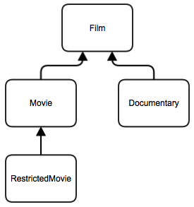

#Film Catalog (FRQ Polymorphism)

A database of films is stored in a class called `FilmCatalog`. Films that are added to the catalog are members of the following class hierarchy:

Examine each of these classes carefully. The `Film` class has data fields for the name, year and star rating. The rating is defined as a number of stars (out of 5).

The `Movie` class includes an array of actors. There is a class called `Actor` to store information about at an actor/actress. This is comprised of their name and gender.

The `RestrictedMovie` class includes a minimum age restriction for watching the movie.

The `Documentary` class includes the topic of the film.

###Part A
Override the `Object`'s `toString` method for the `Film` class. This method should return the name of the film, followed by the year it was made in brackets, followed by the number of star ratings. For example:
>Marvel's The Avengers (2013) ***

###Part B
Override the `Object`'s `equals` method for the `Actor` class. This method should only return `true` if two `Actor` objects have the same name and gender.

###Part C
Complete the `hasActor` method of the `Movie` class. This method should determine if a given actor is in the movie.

###Part D
The `FilmCatalog` class stores films in an `ArrayList`. Complete the `getFilmsByActor` method of the `FilmCatalog` class. This method should return an <tt>ArrayList</tt> of all of the movies that are in the catalog that feature a given actor.

###Part E
Complete the `getBestFilm` method of the `FilmCatalog` class. This method should return the film with the highest rating in a given category for a certain year. The category is given as a `String` parameter and it will have one of the following values:

| Category | Return value |
|---|---|
| Documentary | The highest rated film that is a `Documentary` object |
| Childrens | The highest rated movie that has no age restriction. |
| Comedy | The highest rated movie which has the genre `"Comedy"`. |
| Drama | The highest rated movie which has the genre `"Drama"`. |
| Action | The highest rated movie which has the genre `"Action"`. |
